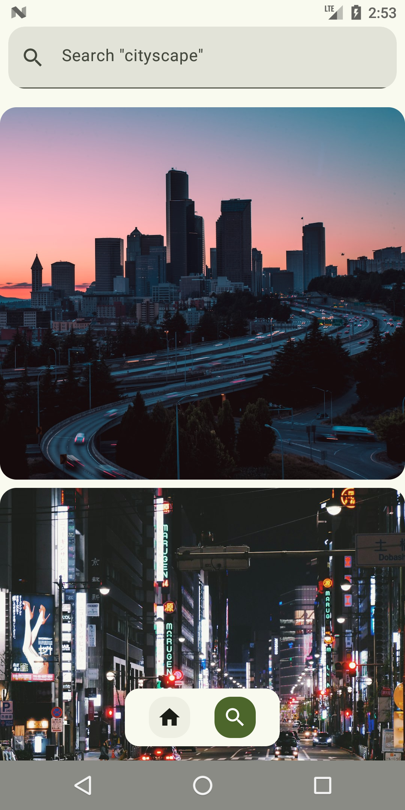

# Imagify

Imagify es una aplicación Android moderna para explorar, buscar y descargar fotos de Unsplash, diseñada con Jetpack Compose y arquitectura limpia. ¡Descubre imágenes increíbles y personaliza tu experiencia!

## Características principales

- 🖼️ Explora fotos editoriales y populares de Unsplash
- 🔍 Búsqueda avanzada por palabras clave y orientación
- 📥 Descarga imágenes directamente a tu dispositivo
- 🎨 Interfaz moderna con Material 3 y Jetpack Compose
- ⚡️ Carga rápida y caché inteligente con Coil
- 🔒 Preferencias de usuario y configuración personalizable
- 🌙 Modo claro/oscuro
- 🔗 Detalles completos de cada foto y autor
- 🛡️ Integración con Firebase Crashlytics y Analytics

## Screenshots

| Pantalla Principal | Búsqueda | Detalle de Imagen |
|--------------------|----------|-------------------|
|  |  |  |

## Instalación y ejecución

1. **Clona el repositorio:**
	```sh
	git clone https://github.com/juanmadev5/Imagify.git
	```
2. **Abre el proyecto en Android Studio.**
3. **Configura tu clave de API de Unsplash:**
	- Ve a `app/src/main/java/com/jmdev/app/imagify/App.kt` y agrega tu API Key en la constante `API_KEY`.
4. **Sincroniza dependencias y ejecuta en tu dispositivo/emulador.**

## Dependencias principales

- [Jetpack Compose](https://developer.android.com/jetpack/compose)
- [Hilt](https://dagger.dev/hilt/)
- [Retrofit](https://square.github.io/retrofit/)
- [Coil](https://coil-kt.github.io/coil/)
- [Firebase Crashlytics, Analytics, Perf](https://firebase.google.com/)
- [Paging 3](https://developer.android.com/topic/libraries/architecture/paging)

## Estructura del proyecto

```
Imagify/
├── app/
│   ├── src/
│   │   ├── main/
│   │   │   ├── java/com/jmdev/app/imagify/
│   │   │   │   ├── data/        # Repositorios y lógica de datos
│   │   │   │   ├── model/       # Modelos de dominio
│   │   │   │   ├── module/      # Inyección de dependencias
│   │   │   │   ├── network/     # API y servicios
│   │   │   │   ├── presentation/# UI y pantallas
│   │   │   │   ├── utils/       # Utilidades
│   │   │   ├── res/             # Recursos gráficos y strings
│   │   ├── test/                # Tests unitarios
│   ├── build.gradle.kts
├── assets/                      # Screenshots
├── README.md
```

## Créditos y agradecimientos

- Fotos proporcionadas por [Unsplash](https://unsplash.com/)
- Iconos de [Material Icons](https://fonts.google.com/icons)
- Desarrollado por [@juanmadev5](https://github.com/juanmadev5)

---

¡Contribuciones y sugerencias son bienvenidas! ⭐
